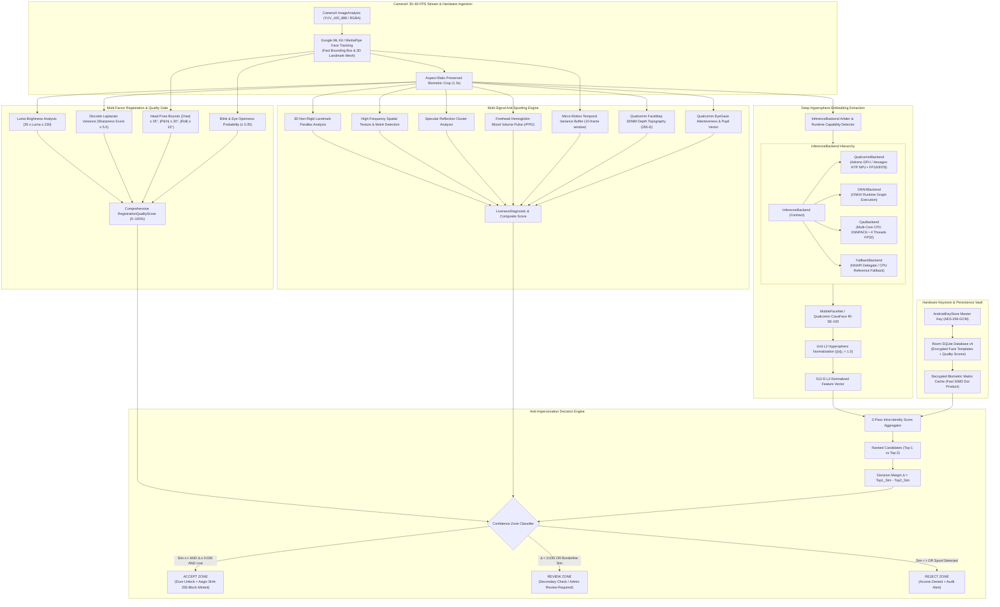

# 🌐 OmniFace AI — Sovereign Biometric Identity Platform Blueprint

**OmniFace AI** is an enterprise-grade, privacy-first, sovereign Edge AI Facial Recognition Identity Platform designed for high-integrity on-device biometric identification, access control, and workforce verification without cloud latency or third-party tracking dependencies.

---

## 🏛️ System Architecture Topology

---

## ⚡ Core Engineering Standards

### 1. Identity Integrity over Recognition Convenience
- **Zero Ambiguous Auto-Accepts**: Even if an individual surpasses the raw threshold $\tau$, if their decision margin over the second-best identity $\Delta = S_1 - S_2 < 0.035$, the match is flagged into the **REVIEW ZONE** to eliminate sibling and lookalike misidentifications.
- **Explainable Biometrics**: Every decision produces an explicit `AttendanceDecision` report detailing:
  - Top-1 Similarity & Roll Number
  - Top-2 Similarity & Roll Number
  - Decision Margin $\Delta$
  - Quality Score & Laplacian Sharpness
  - Multi-Signal Liveness Diagnostic
  - Active Inference Backend & Latency (ms)
  - Full natural-language decision justification.

### 2. Multi-Signal Anti-Spoofing Architecture
Clearly separates **Quality Assessment** from **Spoof Detection** from **Identity Recognition**:
1. **3D Non-Rigid Landmark Parallax**: Quantifies geometric depth shift between nose centroid and inter-pupillary axis (defeats 2D flat paper photos).
2. **Spatial Frequency Laplacian Texture**: Detects high-frequency subpixel Moiré grid aliasing (defeats iPad/smartphone digital replays).
3. **Specular Glare Clustering**: Identifies blown-out polarized saturation highlights from glass and glossy print surfaces.
4. **Physiological rPPG Hemoglobin Pulse**: Measures rolling green-channel reflectance pulse variance with 3-point moving average AC flicker filtering.
5. **Micro-Motion Temporal Variance**: Analyzes yaw, pitch, and eye openness over 10-frame time series to detect static cutouts.
6. **Qualcomm AI Hub Neural Topography**: Leverages FaceMap 3DMM shape parameters and EyeGaze pupil fixation vectors on Snapdragon silicon.

### 3. Registration Excellence & Multi-Sample Consistency
- **5-Angle Biometric Studio**: Captures Frontal (0°), Left (22.5°), Right (22.5°), Up (16°), and Down (16°).
- **Pairwise Consistency Matrix**: Computes $M_{ij} = \mathbf{e}_i \cdot \mathbf{e}_j$ across all 5 samples.
- **Outlier Sample Rejection**: Requires $\min(M_{ij}) \ge 0.78$; rejects unstable or mixed identity registrations.
- **Quality-Weighted Master Centroid**: Generates $\mathbf{c} = \frac{\sum w_k \mathbf{e}_k}{\|\sum w_k \mathbf{e}_k\|_2}$ stored in Room SQLite schema v4.

### 4. InferenceBackend Hierarchy
- **`QualcommBackend`**: Qualcomm Adreno GPU / Hexagon HTP NPU acceleration for CavaFace (65.5M IR-SE-100) and QAI Hub suite models.
- **`ONNXBackend`**: Dedicated ONNX graph execution runner with direct tensor mapping.
- **`CpuBackend`**: Multi-Core 4-thread XNNPACK FP32 reference execution.
- **`FallbackBackend`**: Zero-dependency asset-bundled NNAPI and CPU fallback.

