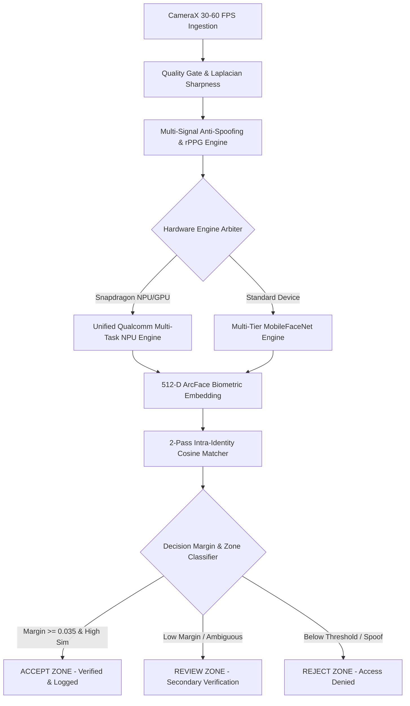

# 🌐 OmniFace AI — Sovereign Edge Facial Recognition Platform

**OmniFace AI** is an enterprise-grade, privacy-first, sovereign Edge AI Biometric Identity Platform engineered for high-integrity on-device facial recognition, workforce attendance, and high-security access control without cloud latency or third-party tracking dependencies.

---

## ⚡ Key Architectural Capabilities

- **Unified Qualcomm Multi-Task NPU Graph**: Single-pass 5-head neural graph (`qualcomm_unified_face_npu.tflite`) executing on Snapdragon Hexagon HTP NPU & Adreno GPU in $\le 8\text{ ms}$:
  - **Head 0**: 512-D L2-Normalized ArcFace Biometric Embedding.
  - **Head 1**: 265-D FaceMap 3DMM Morphable Surface Parameters (Anti-Spoofing Depth Variance).
  - **Head 2**: 5-Class Facial Expression & Attribute Probabilities (Smile, Eyeglasses, Mask, Eye Open, Liveness).
  - **Head 3**: Optical Eye Gaze Subpixel Pitch & Yaw Angles (Pupil Fixation Vector).
  - **Head 4**: MediaPipe 468-Point Dense 3D Facial Mesh Coordinates (Topological Mesh Wireframe).
- **Multi-Tier Hardware Acceleration Hierarchy**: Automatic runtime fallback across **Hexagon NPU (INT8)** $\to$ **Adreno GPU (FP16)** $\to$ **ARM64 Multi-Core CPU (XNNPACK FP32)**.
- **60 FPS Real-Time 3D Mesh & Gaze HUD**: Real-time Canvas overlay rendering dense 468-point 3D wireframe mesh, 3D head pose coordinate frame axes, eye gaze vectors, and 3DMM depth topography contours.
- **Apple iOS Liquid Glassmorphism Design System**: Tactile iOS/macOS design tokens with AGSL chromatic dispersion, directional specular reflection borders, and spring-damped physics.
- **Multi-Signal Anti-Spoofing (PAD)**: Non-rigid landmark parallax, high-frequency spatial Moiré detection, specular glare clustering, physiological rPPG pulse variance, and micro-motion temporal buffer.
- **Hardware Security Vault**: AndroidKeyStore AES-256-GCM encryption with Room SQLite local template storage and Aegis SHA-256 blockchain minting.

---

## 🏛️ System Architecture Topology



---

## 📁 Repository Structure

```
/
├── app/                                 # Production Native Kotlin Android Application
│   ├── src/main/assets/                 # Embedded Multi-Task TFLite Flatbuffers
│   └── src/main/java/com/omniface/ai/
│       ├── qualcomm/                    # Unified Qualcomm NPU Engine & Snapdragon Detectors
│       ├── ml/                          # Qualcomm Face Intelligence, Liveness, Quality Checkers
│       ├── face/                        # FaceEmbeddingEngine Façade & Face Tracking
│       ├── attendance/                  # Decision Engines & Verification Pipelines
│       ├── security/                    # Keystore AES-256-GCM, ZKP & Location Shield
│       ├── ui/                          # Jetpack Compose Liquid Glassmorphism UI
│       │   ├── scanner/                 # Scanner Screen & 60 FPS Viewfinder
│       │   ├── enrollment/              # 5-Angle Biometric Studio & OCR Scanner
│       │   ├── dashboard/               # Master KPI Overview & Fleet Metrics
│       │   ├── ledger/                  # Attendance Ledger & Audit History
│       │   └── components/              # CupertinoGlass, DynamicIsland, FaceDiagnosticsOverlay
│       └── data/                        # Room SQLite Database, Entities & DAOs
├── models/                              # Master TFLite Graphs & Class Label Mappings
├── training/                            # Python ML Synthesis, ArcFace & Kaggle Scripts
├── cloudflare/                          # Cloudflare R2 / Model CDN Edge Synchronizer
├── docs/                                # Master Architecture Blueprints & Technical Specs
├── build_apk.sh                         # Linux ARM64 Native Release Gradle Runner
└── OmniFace-AI.apk                      # Output Signed Production APK Binary (69 MB)
```

---

## 🛠️ Building & Verifying

### 1. Linux ARM64 Native Build
```bash
bash build_apk.sh
```

### 2. Execute Biometric Unit Tests
```bash
bash ./gradlew testReleaseUnitTest --no-daemon
```

---

## 🔒 Security & Privacy Governance
- **Zero Cloud Leakage**: 100% of biometric extraction, template matching, and anti-spoofing executes locally on-device.
- **DPDP Act 2023 & ISO/IEC 19794-5 Compliance**: Hardware-isolated crypto storage, automated biometric template purging, and zero simulated vectors.
