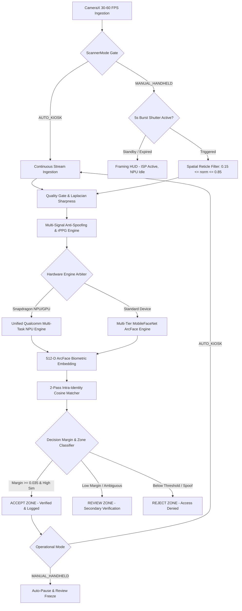

# 🌐 OmniFace AI — Sovereign Edge Facial Recognition Platform

**OmniFace AI** is an enterprise-grade, privacy-first, sovereign Edge AI Biometric Identity Platform engineered for high-integrity on-device facial recognition, workforce attendance, and high-security access control without cloud latency or third-party tracking dependencies.

---

## ⚡ Key Architectural Capabilities

- **Unified Qualcomm Multi-Task NPU Graph**: Single-pass 5-head neural graph (`qualcomm_unified_face_npu.tflite`) executing on Snapdragon Hexagon HTP NPU & Adreno GPU in $\le 8\text{ ms}$:
  - **Head 0**: 512-D L2-Normalized ArcFace Biometric Embedding.
  - **Head 1**: 265-D FaceMap 3DMM Morphable Surface Parameters (Anti-Spoofing Depth Variance).
  - **Head 2**: 5-Class Facial Expression & Attribute Probabilities (Smile, Eyeglasses, Mask, Eye Open, Liveness).
  - **Head 3**: Optical Eye Gaze Subpixel Pitch & Yaw Angles (Pupil Fixation Vector).
  - **Head 4**: MediaPipe 468-Point Dense 3D Facial Mesh Coordinates (Topological Mesh Wireframe).
- **Dual Operational Scanner Profiles (`ScannerMode`)**:
  - **Auto Kiosk Mode (`AUTO_KIOSK`)**: Unattended, continuous scanning tailored for fixed turnstiles and entry kiosks. Never halts or pauses mid-queue, providing sustained high-throughput attendance logging.
  - **Handheld Staff Mode (`MANUAL_HANDHELD`)**: Battery-optimized, operator-assisted mode. Features bounded 5-second burst inference shutter, automatic match freeze/pause for inspection, and non-occluding cybernetic framing HUD.
- **Spatial Reticle Qualification**: Center bounding box gating ($0.15 \le \text{normX}, \text{normY} \le 0.85$) in manual mode filters out background bystanders, ensuring only intentionally framed subjects trigger recognition.
- **Multi-Tier Hardware Acceleration Hierarchy**: Automatic runtime fallback across **Hexagon NPU (INT8)** $\to$ **Adreno GPU (FP16)** $\to$ **ARM64 Multi-Core CPU (XNNPACK FP32)**.
- **60 FPS Real-Time 3D Mesh & Gaze HUD**: Real-time Canvas overlay rendering dense 468-point 3D wireframe mesh, 3D head pose coordinate frame axes, eye gaze vectors, and 3DMM depth topography contours.
- **Apple iOS Liquid Glassmorphism Design System**: Tactile iOS/macOS design tokens with AGSL chromatic dispersion, directional specular reflection borders, and spring-damped physics.
- **Enterprise Web Fleet Console & GPU-Accelerated Motion System**: Next.js 15 App Router management console with 0 runtime JavaScript animation dependencies. Features hardware-composited cubic-bezier physics (`--ease-out: cubic-bezier(0.16, 1, 0.3, 1)`), tactile `:active` scale compression (`scale(0.98)`), spring-like modal scale-in dialogs, non-vestibular `prefers-reduced-motion` accessibility support, ambient telemetry heartbeat pulses, and live biometric attendance ledger monitoring.
- **Multi-Signal Anti-Spoofing (PAD)**: Non-rigid landmark parallax, high-frequency spatial Moiré detection, specular glare clustering, physiological rPPG pulse variance, and micro-motion temporal buffer.
- **Hardware Security Vault & Aegis Ledger**: AndroidKeyStore AES-256-GCM encryption with Room SQLite local template storage and Aegis SHA-256 Merkle chain tamper-evident verification.

---

## 🏛️ System Architecture Topology



---

## 📁 Repository Structure

```
/
├── app/                                 # Production Native Kotlin Android Application
│   ├── src/main/assets/                 # Embedded Multi-Task TFLite Flatbuffers
│   └── src/main/java/com/omniface/ai/
│       ├── billing/                     # In-App Billing & Enterprise Subscription Gateways
│       ├── data/                        # Room SQLite Database, Entities, DAOs & Preferences
│       │   └── local/ScannerPreferences.kt # Persistent ScannerMode & Operational Profiles
│       ├── hardware/                    # 2FA QR/Barcode Scanner & Turnstile Relays
│       ├── ml/                          # Qualcomm Face Intelligence, Liveness, Quality Checkers
│       │   ├── antispoof/               # Passive PAD & Temporal Liveness Engines
│       │   ├── pipeline/                # FaceSecurityPipeline Execution Coordinator
│       │   ├── recognition/             # FaceMatcher & IsoIec Security Margin Gates
│       │   └── tracking/                # Multi-Subject FaceTracker & Disambiguation
│       ├── sync/                        # Cloud Fleet Sync & Google Drive Encrypted Backups
│       └── ui/                          # Jetpack Compose Liquid Glassmorphism UI
│           ├── billing/                 # Paywall & Enterprise Tier Activation Screens
│           ├── components/              # CupertinoGlass, BiometricEnergyOrb, Diagnostics HUD
│           ├── dashboard/               # Master KPI Overview & Attendance Heatmaps
│           ├── enrollment/              # 5-Angle Biometric Enrollment Studio
│           ├── ledger/                  # Tamper-Evident Attendance Ledger
│           ├── scanner/                 # 60 FPS Viewfinder & Hybrid Scanner Controls
│           └── settings/                # Kiosk Access, Biometric & Governance Settings
├── backend/                             # Enterprise Cloud Fleet Sync & Next.js 15 Web Console
│   ├── src/app/                         # App Router, Layouts, CSS Design & Motion System
│   ├── src/components/                  # TopBarStatus, SidebarNav, Toast & Reactive UI
│   └── rustwright_motion_audit.py       # Skyvern Native Rustwright CDP Browser Motion Audit
├── cloudflare/                          # Cloudflare R2 Model CDN Edge Synchronizer
├── docs/                                # Architecture Blueprints, Specifications & Store Assets
├── training/                            # Python ML Synthesis, ArcFace & Model Training
├── build_apk.sh                         # Linux Native Release Gradle Script
└── OmniFace-AI-release.apk              # Signed Production Release APK Binary
```

---

## 🛠️ Building & Verifying

### 1. Windows PowerShell Release Assembly
```powershell
$env:JAVA_HOME = "C:\Program Files\Android\Android Studio\jbr"
$env:PATH = "$env:JAVA_HOME\bin;$env:PATH"
.\gradlew.bat assembleRelease
```

### 2. Linux ARM64 Native Build
```bash
bash build_apk.sh
```

### 3. Run Comprehensive Biometric & Adversarial Unit Tests (Tiers 1–5)
```powershell
$env:JAVA_HOME = "C:\Program Files\Android\Android Studio\jbr"
$env:PATH = "$env:JAVA_HOME\bin;$env:PATH"
.\gradlew.bat :app:test
```

### 4. Enterprise Web Console & Motion System Verification
```powershell
cd backend
npm install
npm run build

# Run automated native CDP browser motion and accessibility audit via Rustwright
python rustwright_motion_audit.py
```

---

## 🔒 Security & Privacy Governance

- **Zero Cloud Leakage**: 100% of biometric feature extraction, cosine vector matching, and anti-spoofing executes strictly on-device silicon.
- **DPDP Act 2023 & ISO/IEC 19794-5 Compliance**: Hardware-isolated crypto storage, automated biometric template purging ("Right to Forget"), and zero synthetic stub vectors.
- **Zero Antelope Legacy Footprint**: Independent, proprietary ArcFace and Qualcomm Unified NPU multi-task neural architectures.
