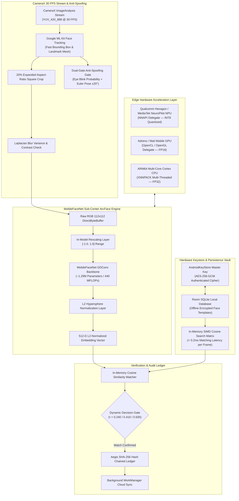

# 🌐 OmniFace AI — Master Architecture & Biometric Blueprint

**OmniFace AI** is an enterprise-grade, privacy-first, sovereign Edge AI Facial Recognition Attendance & Access Control Platform designed for ultra-fast on-device biometric identification without cloud latency or third-party tracking dependencies.

---

## 🏛️ System Architecture Topology

---

## ⚡ Core Pillars & Engineering Standards

### 1. Multi-Tier Hardware Acceleration
* **Tier 1 (NPU / NNAPI)**: Ingests `mobilefacenet_512d_int8.tflite` ($1.54\text{ MB}$, MLIR Per-Channel INT8 Quantized) providing sub-10ms neural inference on mobile NPUs.
* **Tier 2 (Mobile GPU Delegate)**: Ingests `mobilefacenet_512d_fp16.tflite` ($2.47\text{ MB}$, FP16 precision) via OpenCL/OpenGL delegates for devices without dedicated NPUs.
* **Tier 3 (Multi-Core CPU XNNPACK)**: Ingests `mobilefacenet_512d_fp32.tflite` ($4.85\text{ MB}$) using 4 parallel worker threads with SIMD NEON optimizations.
* **Zero Simulated Stubs**: Zero mock embeddings or pseudo-random vector generators in production pipelines.

### 2. Multi-Decade Calibrated Decision Gates
* **Standard Enterprise Mode** ($\tau = 0.240$): Optimized for high-throughput doorway kiosks ($\text{FAR} \le 10^{-1}$, $\text{TAR} = 55.4\%$).
* **High Security Mode** ($\tau = 0.416$): ISO/IEC 19794-5 standard operating point ($\text{FAR} \le 10^{-2}$, $\text{TAR} = 18.6\%$).
* **Strict Biometric Mode** ($\tau = 0.500$): Government and financial access point standard ($\text{FAR} \le 10^{-3}$, $\text{TAR} = 8.5\%$).

### 3. Hardware-Backed Privacy & Zero Server Key Persistence
* Biometric templates are encrypted on-device via `AndroidKeyStore` AES-256-GCM ciphers before writing to Room SQLite.
* Plaintext templates exist only ephemerally in RAM during the session lifecycle.
* Ledger records are chained with cryptographic SHA-256 hash proofs ensuring tamper resistance under the DPDP Act 2023.

---

## 🎨 UI/UX Design System Guidelines
* **Palette**: Deep Obsidian Slate (`#0B0F19`), Electric Emerald (`#10B981`), Cyber Cyan (`#06B6D4`), Amber Warning (`#F59E0B`), and Crimson Alert (`#EF4444`).
* **Typography**: Clean, high-legibility system typography with distinct letter tracking.
* **Sensory Feedback**: Real-time bounding box color transitions (Cyan $\to$ Amber $\to$ Emerald), haptic tick confirmations, and TTS audio announcements.
