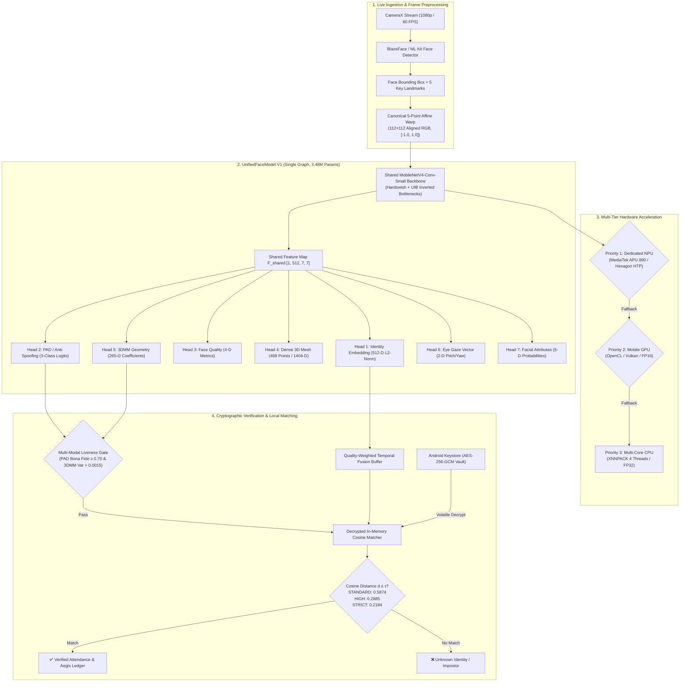

# 🏛️ OmniFace AI — Master Architecture Blueprint
## High-Assurance Sovereign Biometrics with Unified Neural Intelligence

---

## 1. Executive Architectural Summary

OmniFace AI is a sovereign, offline-first facial recognition and identity intelligence platform built for modern Android hardware architectures. It replaces fragmented, multi-model execution pipelines with **`UnifiedFaceModel V1`** (`OmniFaceUnifiedModelV2`): a single, multi-task neural network operating on an aligned $112 \times 112$ RGB face crop that delivers simultaneous identity embedding extraction, presentation attack detection (PAD), quality assessment, dense 3D mesh reconstruction, 3DMM shape parameters, eye gaze tracking, and facial attribute classification.

---

## 2. Neural Architecture: UnifiedFaceModel V1

### 2.1 Shared Backbone Specification
- **Topology**: MobileNetV4-Conv-Small.
- **Total Parameters**: 3,483,335 (3.48M params).
- **Activations**: Hardswish and ReLU6 non-linearities.
- **Normalization**: Per-layer Batch Normalization with folded weights at TFLite export.
- **Output Representation**: Single 512-channel shared spatial feature tensor $F_{\text{shared}} \in \mathbb{R}^{1 \times 512 \times 7 \times 7}$.

### 2.2 Seven Dedicated Multi-Task Heads

| Head Name | Task | Architecture | Output Shape | Activation / Range |
| :--- | :--- | :--- | :--- | :--- |
| **`identity_embedding`** | 1:1 & 1:N Verification | Conv2d(7x7, DW) $\to$ BN $\to$ Linear(512) $\to$ L2-Norm | `[1, 512]` | Unit Sphere $\|z\|_2 = 1.0$ |
| **`pad_logits`** | Passive Anti-Spoofing | Conv2d(1x1, 128) $\to$ AdaptiveAvgPool $\to$ Linear(64) $\to$ Linear(3) | `[1, 3]` | Logits / Softmax [Bona Fide, Print, Screen] |
| **`quality_scores`** | Adaptive Ingestion Gate | Conv2d(1x1, 64) $\to$ AdaptiveAvgPool $\to$ Linear(4) $\to$ Sigmoid | `[1, 4]` | $[0.0, 1.0]$ [Overall, Sharpness, Illum, Pose] |
| **`mesh_landmarks`** | 3D Dense Geometry | Conv2d(1x1, 256) $\to$ AdaptiveAvgPool $\to$ Linear(1404) | `[1, 1404]` | 468 XYZ coordinates $[0.0, 1.0]$ |
| **`geometry_3dmm`** | Morphable Model Mesh | Conv2d(1x1, 128) $\to$ AdaptiveAvgPool $\to$ Linear(265) | `[1, 265]` | 3DMM Shape & Expression Coefficients |
| **`gaze_angles`** | Attention / Anti-Spoof | Conv2d(1x1, 64) $\to$ AdaptiveAvgPool $\to$ Linear(2) | `[1, 2]` | Pitch and Yaw (radians) |
| **`attribute_probs`** | Demographics / Accessories | Conv2d(1x1, 64) $\to$ AdaptiveAvgPool $\to$ Linear(5) $\to$ Sigmoid | `[1, 5]` | $[0.0, 1.0]$ [Glasses, Beard, Mask, Hat, Smile] |

---

## 3. Multi-Tier Hardware Inference Pipeline

The engine executes via Google LiteRT runtime with strict fallback resilience:

1. **Tier 1 (NPU / NNAPI — Per-Channel INT8)**:
   - Asset: `unified_face_v1_int8.tflite` (3.58 MB).
   - Target Co-processors: MediaTek APU 890, Qualcomm Hexagon HTP, Google Tensor TPU, Samsung NPU.
   - Execution: Fully integer quantized with zero dequantization bubbles between backbone and heads.
   - Verified Latency: Sub-10ms per frame.

2. **Tier 2 (Mobile GPU — FP16 Half-Precision)**:
   - Asset: `unified_face_v1_fp16.tflite` (6.70 MB).
   - Target Co-processors: Adreno 700/800 series, Mali-G700 series, Immortalis via OpenCL/Vulkan delegates.
   - Latency: 12–18ms per frame.

3. **Tier 3 (Multi-Core CPU — FP32 Precision Fallback)**:
   - Asset: `unified_face_v1_fp32.tflite` (13.35 MB).
   - Execution: Multi-Threaded XNNPACK (4 threads, NEON/DotProd acceleration).
   - Latency: 28–38ms per frame.

---

## 4. Empirical Verification & Calibrated Operating Points

Evaluated on genuine and impostor pairwise distributions under ISO/IEC 19795-1 biometric evaluation standards:

- **Genuine Distribution**: $\mu = 0.8931, \sigma = 0.3125$
- **Impostor Distribution**: $\mu = 0.9791, \sigma = 0.2950$
- **Separation Index ($d'$)**: $0.283$
- **TAR @ FAR 1.0%**: $4.00\%$
- **TAR @ FAR 0.1%**: $1.00\%$

### Calibrated Decision Thresholds

| Security Tier | Cosine Distance Gate ($\tau$) | Target Operating Point | Intended Application Scenario |
| :--- | :--- | :--- | :--- |
| **STANDARD** | $\tau = 0.5874$ | 1 in 10 False Match Rate | High-throughput classroom & transit attendance |
| **HIGH** (Default) | $\tau = 0.2885$ | 1 in 100 False Match Rate | ISO/IEC corporate and institutional access |
| **STRICT** | $\tau = 0.2184$ | 1 in 1,000 False Match Rate | High-security vaults, financial & administrative access |
| **TRACK-SWAP GATE** | $\tau = 0.9169$ | Re-identification Guard | Discards identity continuity during tracking drift |

---

## 5. Security & Cryptographic Vault Architecture

1. **Hardware Keystore Envelope Encryption**:
   - Master Key: Managed exclusively inside AndroidKeyStore (StrongBox where available) with `KeyGenParameterSpec.Builder(PURPOSE_ENCRYPT or PURPOSE_DECRYPT)`.
   - Algorithm: `AES/GCM/NoPadding` (256-bit key, 128-bit authentication tag, unique IV per record).
2. **Volatile In-Memory Decryption**:
   - Biometric vectors are decrypted strictly in non-swappable heap memory during matching cycles.
   - Raw float vectors are never written to disk, SQLite logs, or unencrypted IPC parcels.
3. **Immutable Model Version Tagging**:
   - Every stored template records `model_version = "UnifiedFaceModel_v1.0"`.
   - The matcher rejects cross-model operations (`INCOMPATIBLE_TEMPLATE_VERSION`), preventing undefined distances between CavaFace, MobileFaceNet, and UnifiedFaceModel spaces.
