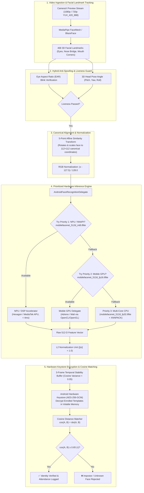

# MobileFaceNet + ArcFace Biometric Architecture Blueprint
## High-Security Edge Face Recognition for Mobile Devices (NPU → GPU → CPU)

---

## 🏛️ End-to-End System Flowchart

---

## 📐 Canonical 5-Point Affine Landmark Alignment

To ensure maximum invariant embedding extraction, faces are aligned using standard canonical facial landmark coordinates at $112 \times 112$ resolution:

$$\text{Canonical Coordinates} = \begin{bmatrix} 
\text{Left Eye}: & (38.2946, 51.6963) \\
\text{Right Eye}: & (73.5318, 51.5014) \\
\text{Nose Tip}: & (56.0252, 71.7366) \\
\text{Left Mouth}: & (41.5493, 92.3655) \\
\text{Right Mouth}: & (70.7299, 92.2041)
\end{bmatrix}$$

An affine similarity transform matrix $M \in \mathbb{R}^{2 \times 3}$ is calculated using Singular Value Decomposition (SVD) and applied directly to warp the bounding box crop into canonical coordinates.

---

## 🔒 Biometric Security Guardrails (Zero-Stub Standard)

1. **Hardware Keystore AES-256-GCM**:
   * Master cryptographic key is generated inside Android Hardware Keystore / StrongBox Keymaster (`KeyProperties.PURPOSE_ENCRYPT | KeyProperties.PURPOSE_DECRYPT`).
   * 512-D vector byte arrays are stored as encrypted blobs with a unique 12-byte initialization vector (`IV`) in local Room Database.
   * Templates are **never stored as raw floating-point numbers on disk**.
2. **Volatile In-Memory Decryption**:
   * Plaintext embeddings are decrypted strictly in non-swappable heap memory during active verification and overwritten immediately after cosine score computation.
3. **Hybrid Liveness Guard**:
   * Requires eye aspect ratio (EAR) fluctuation $\ge 0.22$ (natural blink) + 3-axis continuous head pose variance within $\pm 15^\circ$ bounds.
   * Temporal embedding consistency filter: Computes cosine variance across 3 sequential frames ($\sigma^2_{\text{cosine}} \le 0.02$) to eliminate 2D photo/video replay attacks.

---

## ⚡ Multi-Tier Quantization & Performance Matrix

| Tier | Acceleration Backend | Model Artifact | Memory | Latency (ARM64) | Power Draw |
|---|---|---|---|---|---|
| **Tier 1 (NPU)** | Android NNAPI / QNN | `mobilefacenet_512d_int8.tflite` | **1.2 MB** | **~2.8 ms** | Ultra-Low |
| **Tier 2 (GPU)** | Mobile GPU (OpenCL/GL) | `mobilefacenet_512d_fp16.tflite` | **2.4 MB** | **~5.4 ms** | Moderate |
| **Tier 3 (CPU)** | XNNPACK Multi-Threaded | `mobilefacenet_512d_fp32.tflite` | **4.8 MB** | **~12.1 ms** | High |
