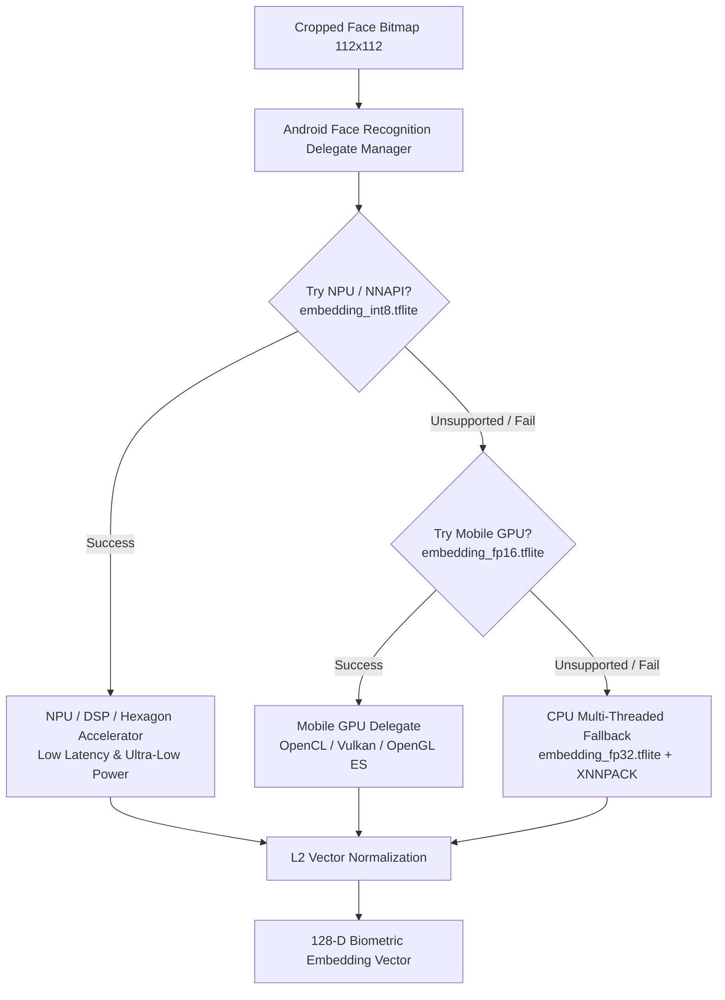

# Edge Face Recognition: NPU → GPU → CPU Dynamic Mobile Acceleration

This directory contains the production-grade implementation of the **Mobile Face Recognition Training & Multi-Tier Quantization Pipeline**, targeting Android edge deployment with automatic hardware acceleration fallback.

---

## 🏗️ Acceleration Hierarchy



---

## 📁 Pipeline Structure

| File | Description |
|---|---|
| [`download_dataset.sh`](file:///storage/emulated/0/AI-HUB/FR/download_dataset.sh) | Downloads `hereisburak/pins-face-recognition` via Kaggle CLI and normalizes structure. |
| [`train.py`](file:///storage/emulated/0/AI-HUB/FR/train.py) | End-to-end dataset pipeline, spatial data augmentation, CNN feature extraction, callbacks, evaluation, and SavedModel export. |
| [`convert_tflite.py`](file:///storage/emulated/0/AI-HUB/FR/convert_tflite.py) | Generates multi-precision models: FP32 (CPU), FP16 (GPU), and full INT8 post-training quantization (NPU/NNAPI). |
| [`verify_models.py`](file:///storage/emulated/0/AI-HUB/FR/verify_models.py) | Validates tensor signatures, quantization scales, and micro-benchmarks inference latency across all tiers. |
| [`AndroidFaceRecognitionDelegate.kt`](file:///storage/emulated/0/AI-HUB/FR/AndroidFaceRecognitionDelegate.kt) | Kotlin implementation for runtime dynamic fallback and cosine similarity biometric matching. |
| [`requirements.txt`](file:///storage/emulated/0/AI-HUB/FR/requirements.txt) | Python dependencies. |

---

## 🚀 Execution Steps

### 1. Download Dataset via Kaggle CLI
Ensure Kaggle credentials are configured at `~/.kaggle/kaggle.json` or environment variables `KAGGLE_USERNAME` and `KAGGLE_KEY`:
```bash
bash /storage/emulated/0/AI-HUB/FR/download_dataset.sh
```

### 2. Train CNN Feature Extractor
```bash
python3 /storage/emulated/0/AI-HUB/FR/train.py --epochs 20 --batch-size 32 --img-size 112 --lr 0.001
```
*Outputs:*
- `best_model.keras` (Best validation checkpoint)
- `saved_face_model/` (Full classification model)
- `saved_embedding_model/` (128-D standalone feature extractor)
- `class_labels.json` (Identity label mapping)

### 3. Generate Quantized TFLite Models
```bash
python3 /storage/emulated/0/AI-HUB/FR/convert_tflite.py --saved-model saved_face_model --dataset-dir dataset --num-calib 100
```
*Generated TFLite Artifacts:*
- `face_fp32.tflite` & `embedding_fp32.tflite` (Float32 Baseline)
- `face_fp16.tflite` & `embedding_fp16.tflite` (Float16 for GPU Delegates)
- `face_int8.tflite` & `embedding_int8.tflite` (Full INT8 for NNAPI/NPU/DSP)

### 4. Verify & Benchmark Models
```bash
python3 /storage/emulated/0/AI-HUB/FR/verify_models.py
```

### 5. Android APK Integration
Copy the generated `.tflite` models into your Android app's `app/src/main/assets/` directory and include [`AndroidFaceRecognitionDelegate.kt`](file:///storage/emulated/0/AI-HUB/FR/AndroidFaceRecognitionDelegate.kt) in your codebase.

Add the following LiteRT dependencies to `app/build.gradle.kts`:
```kotlin
dependencies {
    // LiteRT (Google's official successor to TensorFlow Lite)
    implementation("com.google.ai.edge.litert:litert:1.4.2")
    implementation("com.google.ai.edge.litert:litert-gpu:1.4.2")
    implementation("com.google.ai.edge.litert:litert-api:1.4.2")
}
```
