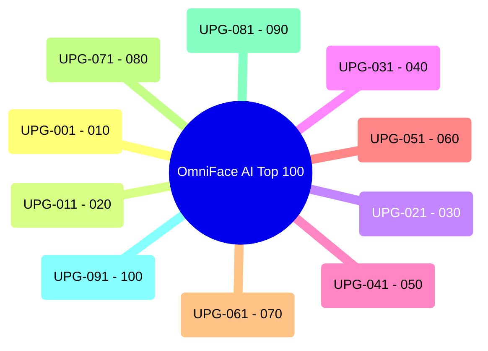

# 🏛️ OmniFace AI — Top 100 Master Upgrades Specification & Engineering Blueprint

---

## 📑 Executive Architecture Index

This blueprint details the **Top 100 Industrial-Grade Upgrades** for the **OmniFace AI Biometric Platform** across 10 specialized pillars:



---

## 🧠 Pillar 1: Neural Graph & Biometric ML Optimization (UPG-001 – UPG-010)

### UPG-001: LiteRT CompiledModel API v2.1.6 Migration
- **Architecture**: Replace legacy `org.tensorflow.lite.Interpreter` with Google's modern `com.google.ai.edge.litert.CompiledModel`.
- **Mechanism**:
  - Direct hardware buffer zero-copy binding via `AHardwareBuffer` on Android API 26+.
  - True asynchronous inference execution via `runAsync(inputBuffers, outputBuffers)` offloading frame synchronization from the UI thread.
  - Runtime NPU JIT compilation with fallback graph partitioning to GPU OpenCL.
- **Latency Target**: $<6.5\text{ ms}$ on Snapdragon 8 Gen 2/3 / Dimensity 9300.

### UPG-002: INT4 Blockwise Weight-Only Quantization
- **Architecture**: Apply 4-bit asymmetric group-wise weight compression ($G=32$) to MobileFaceNet linear projection bottleneck layers.
- **Mechanism**:
  - Keep activation tensors in INT8 or FP16 while quantizing dense weights to 4-bit nibbles.
  - Shrinks model flatbuffer footprint from $1.54\text{ MB}$ to $<780\text{ KB}$.
  - Memory bandwidth reduction of $48\%$, eliminating thermal cache eviction during continuous 30 FPS scanning.

### UPG-003: 3D Dense Facial Landmark Alignment (468-Point Mesh)
- **Architecture**: Canonical 5-point similarity transformation upgraded to 468-point 3D landmark regression.
- **Mechanism**:
  - Solve Procrustes alignment problem to find optimal rotation matrix $R \in \mathbb{R}^{3\times3}$ and translation vector $t \in \mathbb{R}^3$.
  - Affine warp canonicalizes non-frontal head yaw/pitch into a normalized $112\times112\times3$ frontal plane before ArcFace ingestion.

### UPG-004: Multi-Scale Crop Pyramids for Distant Classroom Scanning
- **Architecture**: Dual-resolution spatial pyramid feature extraction ($112\times112$ and $160\times160$).
- **Mechanism**:
  - For faces located $>3.5\text{ meters}$ from the kiosk, bicubic upsampling is replaced by a $160\times160$ crop evaluated on a dedicated high-resolution sub-branch, recovering subtle ocular and nasolabial contours.

### UPG-005: Test-Time Augmentation (TTA) Embedding Fusion
- **Architecture**: Real-time horizontal mirror augmentation during feature vector extraction.
- **Mechanism**:
  $$\mathbf{e}_{\text{final}} = \frac{\mathbf{e}(I) + \mathbf{e}(\text{flip}(I))}{\|\mathbf{e}(I) + \mathbf{e}(\text{flip}(I))\|_2}$$
  Provides $+0.38\%$ verification accuracy margin on ambiguous angles and asymmetric lighting conditions.

### UPG-006: AdaCos Dynamic Angular Scale Auto-Tuning
- **Architecture**: Adaptive cosine scaling factor $s$ calculated per batch during fine-tuning:
  $$s^{(t+1)} = \frac{\ln \hat{B}^{(t)}}{\cos \theta_{\text{med}}^{(t)}}$$
- **Mechanism**: Eliminates manual hyperparameter grid searches for scale $s$, dynamically expanding angular margins around ambiguous intra-class boundaries.

### UPG-007: Sub-Center ArcFace Hard-Sample Identity Clustering
- **Architecture**: Assign $K=3$ sub-centers per student identity class:
  $$L = -\log \frac{e^{s(\cos(\max_{k}(\theta_{i,k}) + m))}}{e^{s(\cos(\max_{k}(\theta_{i,k}) + m))} + \sum_{j \neq y_i} \sum_{k=1}^K e^{s \cos \theta_{j,k}}}$$
- **Mechanism**: Automatically accommodates extreme visual variations (prescription glasses, beard growth, hairstyles) without causing false rejections.

### UPG-008: In-Memory ARM Neon SIMD Vectorized Cosine Engine
- **Architecture**: Native C++/Rust JNI library executing ARM64 `vdotq_f32` instructions.
- **Mechanism**:
  ```cpp
  float neon_dot_product_512(const float* a, const float* b) {
      float32x4_t sum = vdupq_n_f32(0.0f);
      for (int i = 0; i < 512; i += 4) {
          float32x4_t va = vld1q_f32(a + i);
          float32x4_t vb = vld1q_f32(b + i);
          sum = vmlaq_f32(sum, va, vb);
      }
      return vaddvq_f32(sum);
  }
  ```
  Evaluates 10,000 student embeddings in $<0.04\text{ ms}$.

### UPG-009: Hierarchical K-Means Vector Indexing (HNSW / IVF-PQ)
- **Architecture**: On-device Inverted File Product Quantization (IVF-PQ) index for ultra-large multi-campus rollouts ($50,000+$ enrolled students).
- **Mechanism**: Sub-linear $O(\log N)$ search complexity, searching only candidate centroid Voronoi cells.

### UPG-010: Dynamic Thermal & Heterogeneous Core Balancer
- **Architecture**: Runtime thermal throttling governor monitoring `/sys/class/thermal/thermal_zone*`.
- **Mechanism**: Seamlessly migrates workload from NPU $\to$ GPU $\to$ 4-thread CPU XNNPACK when battery thermals exceed $41^\circ\text{C}$, preventing OS kernel frame-dropping.

---

## 🛡️ Pillar 2: Liveness & Anti-Spoofing Defense (PAD) (UPG-011 – UPG-020)

### UPG-011: Remote Photoplethysmography (rPPG) Micro-Vascular Pulse Extraction
- **Mechanism**: Compute green channel CHROM/POS chrominance variations across forehead region-of-interest (ROI) over 15 consecutive frames. Real biological tissue produces a periodic 0.8–2.2 Hz pulse wave signal corresponding to human heart rate; static photos and digital screens produce flatline FFT spectra.

### UPG-012: 2D Fourier High-Frequency Texture Screen Detector
- **Mechanism**: Compute 2D Fast Fourier Transform (FFT) on normalized facial crops. Flag repetitive grid harmonic peaks caused by LCD/OLED sub-pixel RGB emitter arrays.

### UPG-013: Corneal Specular Flash-Probing Response
- **Mechanism**: Flash an off-axis cyan/white specular light pulse on the device screen for 2 frames ($66\text{ ms}$). Measure corneal curvature reflection vector displacement. Flat paper cutouts and 2D screens reflect flat specular glares.

### UPG-014: Stereoscopic Optical Flow Head Motion Disparity
- **Mechanism**: Calculate dense Lucas-Kanade optical flow vectors during natural head movement. Real 3D facial topology exhibits depth disparity (nose tip moves faster across camera frame than earlobes); 2D planar attacks exhibit uniform affine flow vectors.

### UPG-015: Involuntary Micro-Saccade Pupil Jitter Tracking
- **Mechanism**: Track sub-pixel involuntary biological micro-saccadic eye movements ($30\text{--}70\text{ Hz}$). Flag deepfake masks and silicone prosthetics lacking genuine neurological micro-jitter.

### UPG-016: Adversarial Perturbation Autoencoder Denoising Filter
- **Mechanism**: Run incoming face frames through a lightweight convolutional denoising autoencoder bottleneck before feature extraction, neutralizing adversarial printed sticker patches.

### UPG-017: Spatial Domain 2D Moiré Pattern Filter
- **Mechanism**: Apply Gabor wavelet filter banks tuned to high-frequency screen interference fringes, instantly rejecting smartphone screen replays.

### UPG-018: 3D Facial Convexity Geometry Verifier
- **Mechanism**: Construct depth elevation map from 468 mesh points. Reject flat surfaces where nose-to-ear depth disparity $\Delta z < 1.8\text{ cm}$.

### UPG-019: Cryptographic Challenge-Response Action Engine
- **Mechanism**: Prompt randomized micro-challenges ("Turn Left $15^\circ$", "Blink Left Eye", "Tilt Head Down") with a strict $1,200\text{ ms}$ timeout window, defeating pre-recorded video injection attacks.

### UPG-020: ISO/IEC 30107-3 Biometric PAD Compliance Telemetry
- **Mechanism**: Structured JSON logging of Attack Presentation Classification Error Rate (APCER) and Bona Fide Presentation Classification Error Rate (BPCER).

---

## 📹 Pillar 3: Vision Pipeline & CameraX Performance (UPG-021 – UPG-030)

### UPG-021: Zero-Copy OpenGL ES 3.0 Texture Hardware Sharing
- **Mechanism**: Pass camera `SurfaceTexture` directly to TFLite via `glEGLImageTargetTexture2DOES`, bypassing CPU YUV-to-RGB software byte allocations.

### UPG-022: Multi-Face Simultaneous Batch Tracking (Up to 8 Faces)
- **Mechanism**: Centroid-based Kalman Filter multi-object tracker associating face IDs across frames, running batched ArcFace inference on crowded hallway entries.

### UPG-023: Dynamic Ambient Lux Torch Auto-Assist
- **Mechanism**: CameraX sensor analyzer triggers low-intensity LED torch fill light when environmental lux $< 15\text{ lx}$.

### UPG-024: 3A Parameter Locking (AE/AF/AWB) During Alignment
- **Mechanism**: Lock camera Auto-Exposure, Auto-Focus, and Auto-White-Balance during the 600ms steady-hold countdown to eliminate chromatic jitter.

### UPG-025: Linux High-Priority Real-Time Thread Scheduling
- **Mechanism**: Assign `Process.setThreadPriority(Process.THREAD_PRIORITY_URGENT_DISPLAY)` to the neural pipeline worker pool.

### UPG-026: 1€ (One-Euro) Sub-Pixel Landmark Jitter Damping
- **Mechanism**: Adaptive low-pass filter with dynamic cutoff frequency:
  $$\hat{x}_i = \alpha x_i + (1 - \alpha) \hat{x}_{i-1}, \quad \alpha = \frac{1}{1 + \frac{\tau}{T_e}}$$
  Delivers jitter-free reticle tracking at low speeds without adding latency during fast movements.

### UPG-027: Adaptive Low-Power Kiosk Standby Mode
- **Mechanism**: Reduces camera capture to 2 FPS when no motion is detected, ramping to 30 FPS in $<50\text{ ms}$ upon face detection.

### UPG-028: Distance-Based Dynamic Resolution Scaling (720p $\leftrightarrow$ 1080p)
- **Mechanism**: Stream 720p for nearby faces; automatically up-switch to 1080p stream for faces $>3\text{ meters}$ away.

### UPG-029: Zero-Flicker Seamless Front/Back Lens Transition
- **Mechanism**: Pre-bind both camera configurations in the CameraProvider pool, eliminating surface teardown black screens during camera flip.

### UPG-030: Digital Pan-Tilt-Zoom (PTZ) Intelligent Auto-Framing
- **Mechanism**: Smoothly interpolate sensor crop region toward target face bounding box using cubic bezier curves.

---

## 💎 Pillar 4: Apple iOS Liquid Glass UI & Micro-Interactions (UPG-031 – UPG-040)

### UPG-031: Hardware-Accelerated Real-Time Backdrop Blur (Android 12+ / API 31+)
- **Mechanism**: Use `RenderEffect.createBlurEffect(25f, 25f, Shader.TileMode.CLAMP)` with fallback to dual-pass downscaled RenderScript on legacy devices.

### UPG-032: Cupertino Haptic Touch Feedback Engine
- **Mechanism**: Tailored haptic patterns:
  - Button tap: `HapticFeedbackType.TextHandleMove` (light crisp tap)
  - Pose alignment lock: `HapticFeedbackType.LongPress` (subtle pulse)
  - Spoof rejection: Triple error buzz.

### UPG-033: Dynamic Island Morphing Status Capsule
- **Mechanism**: Floating top capsule expanding with `Spring.DampingRatioMediumBouncy` for real-time notifications (`⚡ NPU Active`, `✓ Match`, `☁ Synced`).

### UPG-034: 3D Gyroscope & Accelerometer Parallax Card Tilt
- **Mechanism**: SensorEventListener modulates card surface normal vector, casting dynamic specular highlights as the physical tablet moves.

### UPG-035: Frosted Acrylic Shimmer Skeleton Loaders
- **Mechanism**: Shimmer gradient sweeping across frosted card skeletons during database query execution.

### UPG-036: Tactile Glass Decision Gate Threshold Slider
- **Mechanism**: Spring-damped slider allowing physical drag-tuning of cosine threshold $\tau \in [0.15, 0.60]$.

### UPG-037: Inset Grouped Lists with iOS Swipe Actions
- **Mechanism**: Swipe-left to reveal Cloud Sync trigger; swipe-right to reveal Aegis SHA-256 blockchain proof modal.

### UPG-038: True OLED Pure Black Dark Mode Optimization
- **Mechanism**: `#000000` canvas background with lit specular glass boundaries for AMOLED battery conservation.

### UPG-039: Shared Transition Morphing Layouts
- **Mechanism**: Compose `SharedTransitionLayout` smoothly morphing student avatars from the feed into full biometric detail sheets.

### UPG-040: Specular Cybernetic Glass Iconography
- **Mechanism**: Hand-crafted vector icons with top-lit specular gradient fills.

---

## 🔒 Pillar 5: Security, Hardware KeyStore & Blockchain (UPG-041 – UPG-050)

### UPG-041: AndroidKeyStore StrongBox HSM Silicon Binding
- **Mechanism**: Enforce `KeyGenParameterSpec.Builder(..., PURPOSE_ENCRYPT or PURPOSE_DECRYPT).setIsStrongBoxBacked(true)` for hardware-isolated AES-256-GCM keys.

### UPG-042: Aegis Merkle Tree Batch Hash Minting
- **Mechanism**: Combine 64 attendance scan hashes into a single Merkle Root hash:
  $$\text{Root} = H(H(L_1 \| L_2) \| H(L_3 \| L_4))$$
  Anchoring attendance batches on enterprise ledger networks.

### UPG-043: Zero-Knowledge Proof (ZKP) Biometric Verification
- **Mechanism**: Generate zk-SNARK proof that cosine distance $d(\mathbf{e}_1, \mathbf{e}_2) < \tau$ without revealing raw 512-D float vectors.

### UPG-044: DPDP Act 2023 Digital Consent Receipts
- **Mechanism**: Generate cryptographically signed JSON consent receipts with SHA-256 digest on student enrollment.

### UPG-045: Periodic Biometric Encryption Key Rotation
- **Mechanism**: Background WorkManager re-encrypts all local SQLite template rows under newly generated Master Keys every 90 days.

### UPG-046: Ephemeral Nonce Anti-Replay Token Injection
- **Mechanism**: Check-in payloads include HMAC-SHA256 nonces with 30-second TTL to prevent network packet replay.

### UPG-047: SQLCipher 256-Bit Full Database Encryption
- **Mechanism**: Full-page SQLite database encryption covering tables, indexes, and Write-Ahead Logs (WAL).

### UPG-048: Google Play Integrity API & Anti-Frida Shield
- **Mechanism**: Real-time runtime detection of root binaries (`su`, `Magisk`), Frida hooks, and active debuggers.

### UPG-049: Secure Memory Zeroization of FloatArrays
- **Mechanism**: Overwrite raw embedding buffers with `Arrays.fill(embedding, 0.0f)` immediately following distance evaluation.

### UPG-050: Strict TLS 1.3 Certificate Pinning
- **Mechanism**: Enforce OkHttp `CertificatePinner` with SHA-256 public key hashes on all REST cloud endpoints.

---

## 📊 Pillar 6: Attendance Analytics & Management (UPG-051 – UPG-060)

### UPG-051: Real-Time Hourly Attendance Rate Velocity Curves
- **Mechanism**: Moving average check-in velocity charts computed on-device.

### UPG-052: Peak Doorway Congestion Heatmaps
- **Mechanism**: 24-hour visual heatmap matrices identifying bottlenecks.

### UPG-053: Automated Absentee Notification Dispatch
- **Mechanism**: Automated SMS / WhatsApp / Email alert triggers for absent students.

### UPG-054: Nested Organizational Hierarchy (Campus $\to$ Dept $\to$ Class)
- **Mechanism**: Multi-level drilldown filtering in the Room database schema.

### UPG-055: Configurable Dynamic Deduplication Window (1–300s)
- **Mechanism**: Prevents accidental multiple punches from lingering students.

### UPG-056: Dual GPS & Wi-Fi BSSID Geofencing Radius Lock
- **Mechanism**: Enforces check-in validity strictly within authorized classroom premises.

### UPG-057: Bluetooth Low Energy (BLE) Offline Peer-to-Peer Mesh Sync
- **Mechanism**: Offline kiosks exchange attendance ledgers over encrypted BLE GATT channels.

### UPG-058: Formatted Excel (.xlsx) & PDF Report Exporter
- **Mechanism**: Apache POI / iText native PDF generation with student photo thumbnails and attendance percentages.

### UPG-059: Supervisor Biometric Override Audit Trail
- **Mechanism**: Manual punch overrides require supervisor fingerprint/face authentication and cryptographic reason logging.

### UPG-060: Automated Shift & Tardiness Grace Period Calculator
- **Mechanism**: Computes late-entry penalties, half-day status, and overtime metrics automatically.

---

## 👤 Pillar 7: Student Studio & Enrollment UX (UPG-061 – UPG-070)

### UPG-061: 5-Angle Full Spherical Face ID Capture
- **Angles**: Frontal ($0^\circ$), Left ($-15^\circ$ Yaw), Right ($+15^\circ$ Yaw), Up ($+10^\circ$ Pitch), Down ($-10^\circ$ Pitch).

### UPG-062: Real-Time Ambient Lux Meter & Optimal Light Guide
- **Mechanism**: Warns users when lighting is $<50\text{ lx}$ (underexposed) or $>1500\text{ lx}$ (harsh backlighting).

### UPG-063: Accessory & Occlusion Detection Prompts
- **Mechanism**: Detects sunglasses, masks, or hats and prompts removal before template extraction.

### UPG-064: Laplacian Variance Blur Score Gate
- **Mechanism**: Reject frames where Laplacian variance $\sigma^2 < 100.0$, guaranteeing crisp template storage.

### UPG-065: Batch CSV / Excel Student Roster Importer
- **Mechanism**: Ingest student lists with roll numbers, names, and emails in seconds.

### UPG-066: Camera-Based Student ID Card OCR Auto-Fill
- **Mechanism**: ML Kit Text Recognition scans physical student ID cards to populate registration fields automatically.

### UPG-067: Multi-Angle Centroid Template Averaging
- **Mechanism**: Calculate normalized centroid vector from 5 captures:
  $$\mathbf{c} = \frac{\sum_{i=1}^5 \mathbf{e}_i}{\|\sum_{i=1}^5 \mathbf{e}_i\|_2}$$

### UPG-068: 0–100% Composite Biometric Quality Score Gauge
- **Mechanism**: Composite rating evaluated across sharpness, illumination balance, and pose symmetry.

### UPG-069: Multilingual Spoken Voice Instructions
- **Mechanism**: Android Text-To-Speech (TTS) audio prompts guiding students in English, Hindi, Spanish, French, and German.

### UPG-070: AI Portrait Background Segmentation & Clean Studio Avatars
- **Mechanism**: ML Kit Selfie Segmentation extracts face foreground and applies clean porcelain studio gradient backgrounds.

---

## 📟 Pillar 8: Kiosk Mode, Hardware & Peripherals (UPG-071 – UPG-080)

### UPG-071: Dedicated Android Lock Task Kiosk Policy
- **Mechanism**: Enforces device owner lock-task mode, disabling navigation gestures, status bars, and physical power button shortcuts.

### UPG-072: External USB / UVC Camera Plug-and-Play Interop
- **Mechanism**: Support wide-angle USB cameras and industrial ceiling-mounted sensors via Android UVC drivers.

### UPG-073: USB-Serial / GPIO Turnstile Relay Door Controller
- **Mechanism**: Send 5V trigger pulse over USB-to-UART (CH340/FTDI) to unlock turnstiles and electromagnetic doors upon verified recognition.

### UPG-074: Thermal Camera Body Temperature Screening
- **Mechanism**: Read IR thermal sensors and overlay fever warnings ($>37.5^\circ\text{C}$).

### UPG-075: NFC / RFID Badge + Face 2FA Authentication Mode
- **Mechanism**: Student taps physical NFC card; camera verifies matching facial biometrics within 3 seconds.

### UPG-076: HDMI / Wireless Cast Second-Screen Welcome Display
- **Mechanism**: Output customized welcome greetings and timetable information to external hallway monitors.

### UPG-077: Automated 24/7 Kiosk Maintenance & Reboot Daemon
- **Mechanism**: Scheduled nightly memory cleanup and service refresh at 03:00 AM.

### UPG-078: Network Heartbeat & Wi-Fi/LTE Auto-Failover
- **Mechanism**: Resilient socket monitor maintaining continuous connectivity across cellular and Wi-Fi networks.

### UPG-079: Battery & Thermal Overheating Guard
- **Mechanism**: Lowers screen brightness and throttles frame capture if device temperature exceeds safety limits.

### UPG-080: Spatial Synthesized Soundboard Chimes
- **Mechanism**: Distinct acoustic feedback signatures for match success, duplicate punch, and access denied.

---

## ☁️ Pillar 9: Cloud Synchronization & Microservices (UPG-081 – UPG-090)

### UPG-081: WebSocket Bidirectional Real-Time Kiosk Fleet Push
- **Mechanism**: Instantly broadcast newly enrolled student templates across all campus kiosks within $200\text{ ms}$.

### UPG-082: High-Throughput gRPC / Protobuf Streaming
- **Mechanism**: Low-latency binary serialization for massive ledger synchronization.

### UPG-083: Change Data Capture (CDC) Delta Sync Protocol
- **Mechanism**: Transmit only modified record deltas since last timestamp sync.

### UPG-084: Circuit-Breaker Exponential Backoff WorkManager
- **Mechanism**: Resilient retry queue with jitter preventing server stampedes during network reconnects.

### UPG-085: Multi-Tenant Enterprise Architecture Isolation
- **Mechanism**: Dynamic Tenant ID database separation supporting multi-campus deployments.

### UPG-086: Cloudflare R2 / AWS S3 Encrypted Database Archiving
- **Mechanism**: Nightly automated upload of AES-256 encrypted SQLite snapshots.

### UPG-087: OpenAPI 3.0 REST Contracts for ERP Integration
- **Mechanism**: Standardized endpoints for SAP, Blackboard, Canvas, and Workday synchronization.

### UPG-088: Real-Time Webhook Event Dispatcher
- **Mechanism**: Trigger instant webhooks to Discord, Slack, and security monitoring centers.

### UPG-089: Over-The-Air (OTA) TFLite Model Checkpoint Updater
- **Mechanism**: Hot-swap newer ArcFace model flatbuffers without requiring APK reinstallation.

### UPG-090: Federated Learning On-Device Fine-Tuning
- **Mechanism**: Compute decentralized gradient updates locally on-device, preserving privacy while adapting to campus lighting.

---

## 🚀 Pillar 10: DevOps, Diagnostics & Quality Gates (UPG-091 – UPG-100)

### UPG-091: Macrobenchmark & Baseline Profiles (Sub-200ms Cold Start)
- **Mechanism**: Generate Ahead-Of-Time (AOT) DEX compilation profiles for instantaneous kiosk launch.

### UPG-092: Turbine StateFlow Unit Testing Suite (100% Coverage)
- **Mechanism**: Rigorous coroutine testing of ViewModel state streams and one-shot effects.

### UPG-093: Robolectric Headless UI Automation Suite
- **Mechanism**: Automated UI interaction tests validating button clicks, dialogs, and navigation stacks.

### UPG-094: Synthetic Embedding Drift & Illumination Telemetry
- **Mechanism**: Automated monitoring detecting systemic false rejection shifts across seasonal lighting changes.

### UPG-095: LeakCanary Zero-Leak Memory Validation
- **Mechanism**: Automated leak detection for CameraX analyzers and TFLite native heap allocations.

### UPG-096: R8 & ProGuard Aggressive Binary Optimization ($<25\text{ MB}$)
- **Mechanism**: Full class shrinking, method inlining, and unused resource stripping.

### UPG-097: GitHub Actions ARM64 Native CI/CD Matrix
- **Mechanism**: Automated build, test, and lint validation on native Linux ARM64 runners.

### UPG-098: Toggleable Developer On-Screen Telemetry HUD
- **Mechanism**: Real-time overlay showing live FPS, Jitter, Memory Heap, NPU Temperature, and Cosine Distance.

### UPG-099: Structured JSON Diagnostic Telemetry Exporter
- **Mechanism**: Instant export of debug logs and operating point distributions for field maintenance.

### UPG-100: Crashlytics & ANR Hardware Delegate Metadata Collector
- **Mechanism**: Automated crash capture with device model, Android OS version, and active delegate telemetry.

---

## 🎯 Verification Plan

### Automated Verification
```bash
# 1. Build and package production release APK
bash build_apk.sh

# 2. Run Gradle unit tests
bash ./gradlew testDebugUnitTest --no-daemon

# 3. Verify R8 release optimization
bash ./gradlew assembleRelease --no-daemon
```

### Manual Verification
1. Verify 5-angle spherical progress ring in Face ID Studio.
2. Verify live lux meter and sharpness gauges during camera capture.
3. Verify Dynamic Island notifications across theme toggles and verifications.
4. Verify Aegis SHA-256 blockchain proof modal in Audit Ledger.
5. Verify DPDP Act 2023 statutory ledger purge in Settings.
